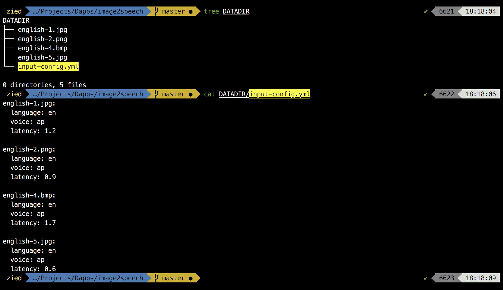
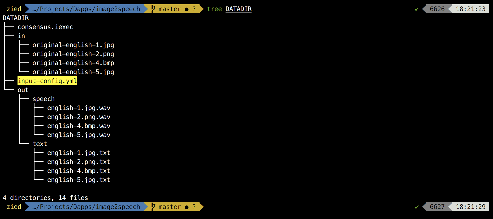

## Description

image2speech is an Ethereum ready dapp that combines the functionalities of two other dapps: [image2text](https://github.com/Zied-Guesmi/image2text) and [text2speech](https://github.com/Zied-Guesmi/text2speech). It applies google's [tesseract-OCR](https://github.com/tesseract-ocr/tesseract) engine to extract text from images and uses [mimic](https://github.com/MycroftAI/mimic) tts engine to convert text to speech and save them in wav format.  


## Usage

Bring your images together in a folder (exp: DATADIR) and add an ```input-config.yml``` file in the same folder. This file contains configuration for each image it should respect the following format:

    <imagename 1>:
        language: <lang>
        voice: <voice name>
        latency: <value>

    <imagename 2>:
        language: <lang>
        voice: <voice name>
        latency: <value>

You can keep the language's section empty but this may affect the performance of the extraction process. If voice name and latency are not defined the app will default to "ap" voice and 1.0 latency.



In the ```app/app-config.yml``` file, change the datadir parameter to the path of your folder (DATADIR for our example) and run the script.

    $ git clone https://github.com/Zied-Guesmi/image2speech.git && cd image2speech/
    $ sed -i "s/\/iexec/<path/to/datadir/folder>/" app/app-config.yml
    $ python3 app/src/app.py

You shoud find your text/sound files in the ```DATADIR/out/``` folder.




## Supported languages

English (for now).


## Supported image types

Tested extensions: **jpeg**, **bmp**, **png**  
Those extensions are accepted but were not tested yet: **pbm**, **pgm**, **ppm**, **tiff**, **rast**, **xbm**  


## Voices

**Male**: ap, awb_time, awb, kal, kal16, rms.  
**Female**: slt_hts, slt.  
See voice samples [here](https://github.com/Zied-Guesmi/image2speech/tree/master/voice-samples).


## Dependencies

- [python3](https://www.python.org/)  
- [tesseract-ocr](https://github.com/tesseract-ocr/tesseract)  
- [opencv](https://opencv.org/)
- [mimic](https://github.com/MycroftAI/mimic) tts engine


## Docker deployment

After installing [docker](https://docs.docker.com/install/) and preparing your DATADIR folder, just grab the docker image from dockerhub and run it:

    $ docker run -v abs/path/to/datadir:/iexec/ ziedguesmi/image2speech

Or you can build your own image from dockerfile:

    # clone the dapp
    $ git clone https://github.com/Zied-Guesmi/image2speech.git && cd image2speech/ 

    # build the docker image
    $ docker build -t image2speech .

    # run the container
    $ docker run -v abs/path/to/datadir:/iexec/ image2speech


## Installation

Install system dependencies:

    # ubuntu as an example
    $ apt-get update && apt-get install -y \
        automake \
        gcc \
        git \
        libasound2-dev \
        libsm6 \
        libtesseract-dev \
        libtool \
        make \
        pkg-config \
        python3 \
        python3-pip \
        tesseract-ocr \
        tesseract-ocr-ara \
        tesseract-ocr-eng \
        tesseract-ocr-fra \
        tesseract-ocr-spa \
        tesseract-ocr-deu \
        tesseract-ocr-chi-sim \
        tesseract-ocr-ita \
        tesseract-ocr-jpn \
        tesseract-ocr-por \
        tesseract-ocr-rus \
        tesseract-ocr-tur \
        tesseract-ocr-kor \
        unzip \
        wget

Install mimic tts engine

    $ git clone https://github.com/MycroftAI/mimic.git && cd mimic
    $ ./dependencies.sh --prefix="/usr/local"
    $ ./autogen.sh
    $ ./configure --prefix="/usr/local"
    $ make


Clone the app:

    $ git clone https://github.com/Zied-Guesmi/image2speech.git && cd image2speech/

Install python depedencies:

    $ pip3 install -r app/requirements.txt


## TODO

- Support more languages.
- Add more mimic voices.
- Reduce mimic docker image size.


## Authors

- **[Zied Guesmi](https://github.com/Zied-Guesmi)**


## License

This project is licensed under the MIT License - see the [LICENSE](https://github.com/Zied-Guesmi/text2speech/blob/master/LICENSE) file for details